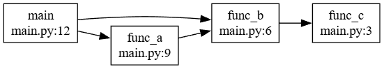

# Call Graph LLM Agent



Call graphs. Zero boilerplate. Infinite scale.
- Support **any** programming languages
- Support **any** lines of code
- Powered by multi-agents LLM

## Architecture

```
┌─────────────────────────────────────────────────────────────────┐
│                    Input: File or Directory                     │
└────────────────────────────┬────────────────────────────────────┘
                             │
                             ▼
┌─────────────────────────────────────────────────────────────────┐
│                        Doc Agent                                │
│  • Extract function definitions from source code                │
│  • Smart sliding window size for large files                    │
│  • Returns: List of functions with locations                    │
└────────────────────────────┬────────────────────────────────────┘
                             │
                             ▼
┌─────────────────────────────────────────────────────────────────┐
│                     Call Graph Agent                            │
│  • Extract call relationships for each function                 │
│  • Smart sliding window size for function bodies                │
│  • Returns: Edges connecting caller -> callee                   │
└────────────────────────────┬────────────────────────────────────┘
                             │
                             ▼
┌─────────────────────────────────────────────────────────────────┐
│              Output: Call Graph (JSON/Graphviz/Stdout)          │
└─────────────────────────────────────────────────────────────────┘
```

## Usage
Make sure installing dependencies(see [Dev](#dev)) first!

```bash
$ ./cga path/to/file.py --llm ollama --llm-config "model=gpt-oss:20b host=http://localhost:11434" --out output/graph.dot -f graphviz
$ ./cga path/to/file.py --llm openai --llm-config "model=gpt-5 api_key=YOUR_KEY" --out callgraph.json -f json

# For example, to generate call graph for example/py-simple/input/main.py with ollama's gpt-oss:20b with graphviz style
$ ./cga callgraph-benchmark/python/project1/main.py --llm ollama --llm-config "model=gpt-oss:20b host=http://<replace with your ollama host>" --out example/py-simple/output/graph.dot -f graphviz
```

## Dev
```bash

# if using uv
$ uv sync

# if using uv and need to install dev's dependencies
$ uv sync --extra dev

# if using pip
$ pip install .

# if using pip and need to install dev's dependencies
$ pip install -e ".[dev]"
```